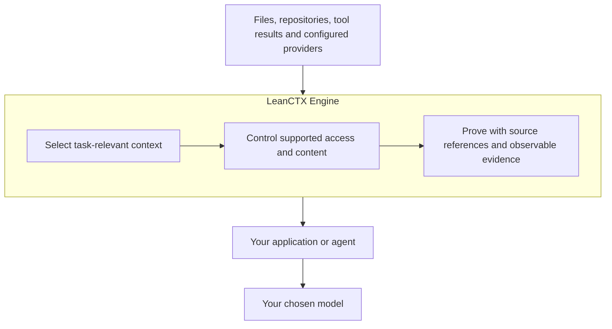

# LeanCTX architecture

**Context Gateway for AI Systems**

**Control what your AI can see.**

The LeanCTX Engine operates between sources/tools and the AI application that
consumes their results. The LeanCTX SDK exposes supported Engine interfaces to
applications that own their model calls and workflow.

## Select → Control → Prove

This describes the information path, not a universal connector catalog. A source
requires a supported configured adapter and permissions. In a context-only
integration the host makes the model call; LeanCTX records the prepared result.
A supported proxy or governed execution path can additionally observe and control
the requests routed through it.

## Runtime mechanisms

| Responsibility | Mechanisms and source |
|---|---|
| Select | Retrieval/ranking, Tree-sitter views, configured LSP backends, graph, task budgets, compression and reuse; `rust/src/tools/`, `rust/src/core/`, `rust/src/lsp/` |
| Control | Configured PathJail/roles, shell policy, secret redaction and policy-driven content filters; `core/pathjail.rs`, `core/io_boundary.rs`, `core/policy/`, `core/input_filters/` |
| Prove | Source references, operation receipts, local measurements, provider observations where visible and offline verification; `core/engine_receipt_artifact.rs`, `core/gain/`, `rust/crates/lean-ctx-protocol/` |
| Integrate | CLI, MCP, supported hooks/proxy and versioned Engine interfaces; standalone [LeanCTX SDK](https://github.com/Thinkery-AG/leanctx-sdk) |

The technical lifecycle **Select → Shape → Reuse → Recover** is implemented
inside these responsibilities. Recovery is subject to source/archive lifetime
and authorization. Detector coverage and sandbox limits are documented in
[SECURITY.md](SECURITY.md).

## Distribution and ownership

- **Community:** the Apache-2.0 public Engine and supported local interfaces.
- **Enterprise:** separately licensed organization controls and deployment;
  private services consume documented boundaries. Customer agreement and
  release status determine the supported scope.
- **SDK / OEM:** language-native integration with its own artifact licenses.
  Stable SDK lifecycle/Agent Tools and explicitly Preview APIs are distinct.

The customer owns agent scheduling, workflow, UI, model choice and application
retry policy. LeanCTX complements those systems; it does not become an agent
framework or a hosted application.

Implementation modules and generated inventories are not availability claims.
Consult the [Vision status map](VISION.md), [SDK surface](docs/reference/sdk-surface.md),
[canonical positioning](docs/POSITIONING_CANONICAL.md) and the individual released
contract before depending on a feature.
