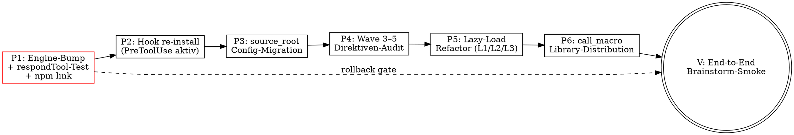

@markdownai v1.0

# Spec — markdownai v1.0 Adoption + mdai-Skill v0.1.1 Refactor

@constraint id="hard-gate" severity="high"
Diese Spec ist ein DESIGN-DOCUMENT. Sie schreibt KEINEN Plan und KEINEN Code.
Plan-Erstellung erfolgt durch `/superpowers:writing-plans` als nächster
Skill-Invocation. Implementation erfolgt erst nach Plan-Approval.

@constraint id="scope-coupling" severity="high"
Diese Spec koppelt zwei Themen bewusst: (a) markdownai-Bump 0.0.24→v1.0.0 mit
respondTool-Empirik-Decision und (b) mdai-Skill-Refactor (Lazy-Load + Wave-3–5-
Direktiven-Adoption + call_macro-Pattern). Die Kopplung ist notwendig, weil das
Skill-Refactor neue v1.0-Direktiven voraussetzt, die ohne Engine-Bump nicht
verfügbar sind. Trennung erzwingt einen brüchigen Zwischenzustand.

@constraint id="supersedes" severity="medium"
Diese Spec ersetzt `2026-05-25-mdai-brainstorm-lazyload-and-namespace-resolver-design.mdai.md`.
Die Engine-Resolver-Idee aus der Vorgänger-Spec wird **gestrichen** und durch
v1.0 `security.json` `source_root`/`data_root`-Config + `${MDAI_LIBRARY_ROOT}`-
Globs ersetzt. Lazy-Load-Anteil (L1/L2/L3) wandert mit, aber jetzt MCP-first
(call_macro statt @include für L2).

## 1. Goal & Scope

### 1.1 Goal

markdownai von lokalem feat-mdai-Stand (Patch über 0.0.24) auf upstream
**v1.0.0** bumpen und die v1.0-Features so adoptieren, dass:

- Der Engine-Resolver-Patch aus der alten Spec **obsolet** wird (config-only)
- Der mdai-Skill von neuen Direktiven (`@if`/`@switch`/`@mkdir`/`@foreach`/…)
    + Hooks (PreToolUse ironclad + SessionStart) profitiert
- `call_macro` als primäres Library-Distribution-Pattern etabliert wird
- Die Lazy-Load-Mechanik echte Token-Effekte erzielt (MCP-first statt @include)

### 1.2 In-Scope

@prompt role="reference"

**Engine + CLI + MCP (`markdownai/packages/`):**

- Merge `origin/main` (29 commits ahead) in `feat-mdai`
- `respondTool()`-Wrapper Empirik-Test in Claude Code (mit/ohne Wrapper)
- Final-Decision: Patch droppen ODER reapplyen
- `npm link` für globalen `mai`-Aufruf (P1d)

**Config (`~/.markdownai/security.json`):**

- `filesystem.source_root: "auto"`
- `filesystem.data_root: "cwd"`
- `filesystem.allowed_source_paths: ["${MDAI_LIBRARY_ROOT}/**", ...]`
- `filesystem.allowed_data_paths: ["${MDAI_LIBRARY_ROOT}/**", "<repo>/docs/mdai/**"]`

**Hooks (`~/.markdownai/hooks/` + `~/.claude/settings.json`):**

- `rm` alter v0.x preToolUse.mjs (force overwrite)
- `node markdownai/packages/core/dist/cli.js init --client claude-code`
- v1.0 PreToolUse-Hook (frontmatter-aware + ironclad REDIRECT_MESSAGE)
- v1.0 SessionStart-Hook (spawn `mai render CLAUDE-MarkdownAI.md`)
- Optional: `init --global-claude-md --update` für CLAUDE.md-Section

**Skill (`mdai/skills/mdai-brainstorm/`):**

- L1: `spec-directive-conventions.md` (write-outputs phase, @include) — neu mit "v1.0 native equivalent"-Spalte
- L2: `spec-self-review.md` (handoff phase, **call_macro MCP-first** — kein @include)
- L3: `process-principles.md` (dialog-process inline, @include token-neutral)
- `body.mdai.md`: Phase-Verschiebung + Process-Checklist mit phase-transition hints
- `spec-reviewer.md`: Lean-Re-Shape (~45 Z statt 168 Z, library-pack)
- `write-spec.md`: `write_review_report` mit `@mkdir` + `@render-template` (P4-adoption)

**Foundation (`mdai/core/`):**

- `startup-check.md`: `+ @define detect_mai_hook_version()` (statt gestrichenem `detect_mdai_root()`)
- `lean-context-audit.md` (NEU): `@define lean_context_audit(spec_path)` mit `@foreach`-loop
- `library-spec-audit.md` (NEU): `@define library_spec_audit(spec_path)` conditional via `@if file.containsLine`

**Audit (`docs/mdai/audits/`):**

- `2026-05-25-wave-3-5-adoption-audit.md` (NEU) — Komplett-Audit aller Wave-3–5-Direktiven gegen alle mdai-Files

### 1.3 Out-of-Scope

@prompt role="reference"

**Gestrichen aus alter Spec:**

- Engine-Patch `resolveMdaiRoot()` — ersetzt durch v1.0 config
- `mdai/`-Namespace-Resolver — ersetzt durch `${MDAI_LIBRARY_ROOT}`-Globs
- `@define detect_mdai_root()` — gestrichen, nicht refactored
- `[mdai-bootstrap] MDAI_LIBRARY_ROOT=...`-Diagnostic — Engine v1.0 emittet eigene ENOENT-Diagnose

**Backlog (eigene Folge-Specs):**

- `CLAUDE-MarkdownAI.md` Adoption (Mini-Spec nach P3)
- Migration anderer mdai-Skills auf v1.0 (Audit-Sweep nach Release)
- `@event`-Adoption für progress-broadcasting im skill
- `--passthrough`-flag im skill-testing-workflow
- mdai-writing-plans Skill (aus alter Spec)
- mdai-drift-check Skill (aus alter Spec)
- Promotion `spec-self-review` zu `mdai/core/` (YAGNI bis 2. Konsument)
- §8.1/§8.2/§8.3 User-driven Smoke-Tests (deferred aus v0.1.0)
- markdownai-Upstream-Bug-Report für False-Branch (§8.5.2)
- respondTool-Patch upstream PR (falls P1b fail → patch nötig bleibt)

**Bewusst nicht adoptiert:**

- `@test`, `@check` (REFUSED in CLAUDE-MarkdownAI.md, im skill nur via MCP)
- `@http`, `@db`, `@query` (lean-context Discipline)
- 6-Phasen-Skill-Variante (5-Phasen reicht)

### 1.4 Success Criteria

@prompt role="reference"

1. `mcp__markdownai__list_phases(file="body.mdai.md", cwd=...)` liefert
   5 phases in Claude Code (mit oder ohne respondTool-Wrapper — verifiziert).
2. `@include ${MDAI_LIBRARY_ROOT}/core/lean-context.md` resolved über
   v1.0-Config, **ohne** Engine-Patch.
3. PreToolUse-Hook blockt `Read` auf `body.mdai.md` mit ironclad REDIRECT_MESSAGE
   (incl. YAML-Frontmatter-Detection).
4. mdai-brainstorm dialog-process-Phase source ≤ 600 W, handoff ≤ 100 W
   (MCP-first lazy auf call_macro-Ebene).
5. `mcp__markdownai__call_macro(file="mdai/core/library-spec-audit.md",
   macro="library_spec_audit", args=...)` rendered korrekt (`found: true`).
6. Smoke-Suite §8.1–§8.15 alle pass (oder dokumentiert deferred).
7. `which mai` zeigt globalen Symlink auf lokalen `npm link`-Build.

## 2. Phasen-Architektur

### 2.1 Layer-Modell

```
┌─────────────────────────────────────────────────────────────────┐
│ Layer 1: markdownai Engine (upstream v1.0.0)                    │
│  - source_root + data_root jail split (config-driven)           │
│  - Wave 3–5 directives: @mkdir, @if, @switch, @foreach, …       │
│  - respondTool: empirisch decided (P1b)                         │
└─────────────────────────────────────────────────────────────────┘
                  ▲  config via ~/.markdownai/security.json
┌─────────────────────────────────────────────────────────────────┐
│ Layer 2: markdownai Hooks (installed via `mai init`)            │
│  - PreToolUse: frontmatter-aware @markdownai detection          │
│  - SessionStart: optional CLAUDE-MarkdownAI.md (Backlog)        │
└─────────────────────────────────────────────────────────────────┘
                  ▲  hook-protocol (JSON-RPC over stdin)
┌─────────────────────────────────────────────────────────────────┐
│ Layer 3: mdai library + skills (lean-ctx project)               │
│  - mdai/core/: shared packs (call_macro-callable)               │
│  - mdai/skills/mdai-brainstorm/: refactored mit Wave 3–5 dirs   │
└─────────────────────────────────────────────────────────────────┘
```

### 2.2 Phasen-Reihenfolge



**Gate-Discipline:** Jede Phase endet mit isoliertem Smoke-Test. Nur bei Pass
geht's zur nächsten Phase. P1 ist hartes Gate.

### 2.3 Tool-Discipline (verbindlich für Plan + Spec)

@prompt role="reference"

```
✗ FALSCH:  Read / cat / head / tail / grep / rg / ls / find / wc
✗ FALSCH:  ctx_read mode="full" für context-only files
✗ FALSCH:  `mai <cmd>` als bare CLI-Aufruf in der Spec
              (auch wenn global installed — direct-node-call ist deterministisch)

✓ search-first: ctx_search(pattern, path) zur Lokalisierung
✓ targeted reads: ctx_read(path, mode="signatures" | "map" | "lines:N-M")
✓ ctx_shell für git/npm/node-CLI
✓ ctx_edit als Fallback wenn Edit ohne vorherigen Read
✓ CLI-Aufrufe: ctx_shell "node markdownai/packages/core/dist/cli.js <cmd>"
✓ skill-internal: mcp__markdownai__<tool>(...)
```

## 3. Phase 1: Engine-Bump + respondTool-Empirik + npm link

### 3.1 Pre-State

- `feat-mdai` Branch ist 1 commit ahead von `origin/main@0.0.24` (`0590beb`
  respondTool-Patch über 0.0.24).
- `origin/main` ist 29 commits ahead → v1.0.0 (tag).
- `respondTool()`-Wrapper upstream entfernt; `respond(id, result)` direkt.

### 3.2 P1a — Engine-Bump

```
1. ctx_shell "cd markdownai && git tag pre-v1.0-bump HEAD"
2. ctx_shell "cd markdownai && git fetch origin"
3. ctx_shell "cd markdownai && git merge origin/main"
   → Merge-Konflikt erwartet in packages/mcp/src/server.ts (respondTool-Block)
   → Vorerst respondTool BEHALTEN (defensive), commit als merge.
4. ctx_shell "cd markdownai && npm install"
5. ctx_shell "cd markdownai && npm run build --workspace packages/parser"
6. ctx_shell "cd markdownai && npm run build --workspace packages/engine"
7. ctx_shell "cd markdownai && npm run build --workspace packages/mcp"
8. ctx_shell "cd markdownai && npm run build --workspace packages/core"
```

### 3.3 P1b — respondTool-Empirik

**P1b-Test 1 (mit Patch):**

- respondTool-Wrapper aktiv (post-merge default)
- Test: `mcp__markdownai__list_phases(file="mdai/skills/mdai-brainstorm/body.mdai.md", cwd="<repo>")`
- Pass-Kriterium: result sichtbar in Claude Code, enthält `phases: [...]`

**P1b-Test 2 (ohne Patch):**

```
ctx_shell "cd markdownai && git revert 0590beb --no-edit"
ctx_shell "cd markdownai && npm run build --workspace packages/mcp"
```

- Selber Test: `mcp__markdownai__list_phases(...)`

### 3.4 P1c — Decision-Tree

@prompt role="reference"

| Test 1 (mit) | Test 2 (ohne) | Decision                                                                                |
|--------------|---------------|-----------------------------------------------------------------------------------------|
| pass         | pass          | **Drop patch.** `git revert 0590beb` bleibt, committen.                                 |
| pass         | fail          | **Reapply patch.** `git revert HEAD` (revert-the-revert). Upstream-Issue dokumentieren. |
| fail         | fail          | **Stop.** Engine-Bump hat tieferes Problem — rollback.                                  |
| fail         | pass          | Unmöglich (Wrapper kann nicht schaden) — bei Auftritt manuell debuggen.                 |

### 3.5 P1d — Global install via npm link

```
ctx_shell "cd markdownai/packages/parser && npm link"
ctx_shell "cd markdownai/packages/engine && npm link"
ctx_shell "cd markdownai/packages/mcp && npm link"
ctx_shell "cd markdownai/packages/core && npm link"
ctx_shell "cd markdownai/packages/core && npm link @markdownai/engine @markdownai/parser @markdownai/mcp"
```

Nach P1d ist `mai` auf `$PATH` mit symlink auf den lokalen Build.

### 3.6 P1-Verifikation

```
V1. ctx_search(pattern="\"version\":\\s*\"1\\.0\\.0\"", path="markdownai/packages/core/package.json")
    → 1 match.

V2. ctx_search(pattern="@switch|@mkdir|isMarkdownAIDocument", path="markdownai/packages/engine/src")
    → ≥3 matches (Wave 3–5 directives + hook script present).

V3. mcp__markdownai__list_phases(file="mdai/skills/mdai-brainstorm/body.mdai.md", cwd="<repo>")
    → phases-Array sichtbar in Claude Code.

V4. respondTool-Decision dokumentiert:
    ctx_search(pattern="respondTool", path="markdownai/packages/mcp/src/server.ts")
    → entweder 0 matches (P1b pass → patch dropped)
    ODER ≥1 match (P1b fail → patch reapplied).

V5. ctx_shell "which mai" → /usr/local/bin/mai (oder ähnlich, via npm link).
V6. ctx_shell "mai --version" → 1.0.0.
```

### 3.7 P1-Rollback

```
ctx_shell "cd markdownai && git reset --hard pre-v1.0-bump"
ctx_shell "cd markdownai && npm install && npm run build"
ctx_shell "cd markdownai/packages/core && npm unlink"
```

## 4. Phase 2: Hook re-install

### 4.1 Pre-State

- `~/.markdownai/hooks/preToolUse.mjs` ist v0.x (kein frontmatter-support).
- `~/.markdownai/hooks/sessionStart.mjs` existiert nicht.
- `~/.claude/settings.json` enthält v0.x PreToolUse-Eintrag.

### 4.2 Migration-Schritte

```
1. ctx_search(pattern="MarkdownAI PreToolUse hook", path="~/.markdownai/hooks/preToolUse.mjs")
   → 1 match (alter v0.x-Hook).

2. ctx_shell "cp ~/.claude/settings.json ~/.claude/settings.json.pre-v1.0"
   → Backup für rollback.

3. ctx_shell "rm ~/.markdownai/hooks/preToolUse.mjs"
4. ctx_shell "rm -f ~/.markdownai/hooks/sessionStart.mjs"
   → Force-Removal damit mai init beide neu schreibt
     (ensureHookFile() skipped sonst weil Marker identisch).

5. ctx_shell "node markdownai/packages/core/dist/cli.js init --client claude-code"
   → schreibt beide hooks + settings.json-Einträge.

6. Optional:
   ctx_shell "node markdownai/packages/core/dist/cli.js init --global-claude-md --update"
   → opt: refresh ~/.claude/CLAUDE.md MarkdownAI-Section.
   Decision-Gate: skip wenn lean-ctx-CLAUDE.md (lokal) ausreichend ist.
```

### 4.3 SessionStart-Hook-Handling

@prompt role="reference"

SessionStart-Hook spawnt `spawnSync('mai', ['render', filePath], ...)`. Mit
P1d (`npm link`) ist `mai` auf `$PATH`, also funktioniert der Hook.

Solange keine `CLAUDE-MarkdownAI.md` im Projekt-Root existiert, exits der Hook
silent (0). Kein stderr-noise, kein additionalContext-Inject.

`CLAUDE-MarkdownAI.md` Adoption ist **Backlog** (Mini-Spec nach P3, weil sie
source_root-Config voraussetzt sobald `@include`-Direktiven involviert sind).

### 4.4 Anpassung in `mdai/core/startup-check.md`

Statt des gestrichenen `detect_mdai_root()`-Macros bekommt `startup-check.md`
einen Hook-Versions-Check (P4-adoption-Vorgriff):

```
@define detect_mai_hook_version()
  @if file.exists "~/.markdownai/hooks/preToolUse.mjs"
    @if file.containsLine "~/.markdownai/hooks/preToolUse.mjs" "isMarkdownAIDocument"
      [mdai-bootstrap] mai-hook: v1.0 (frontmatter-aware)
    @else
      [mdai-bootstrap] mai-hook: v0.x — RUN `node markdownai/packages/core/dist/cli.js init`
    @endif
  @else
    [mdai-bootstrap] mai-hook: not installed — RUN init
  @endif
@end
```

`mdai_bootstrap()` ruft `@call detect_mai_hook_version()` statt des gestrichenen
`detect_mdai_root()`.

### 4.5 P2-Verifikation

```
V1. ctx_search(pattern="isMarkdownAIDocument", path="~/.markdownai/hooks/preToolUse.mjs")
    → ≥1 match (v1.0 frontmatter-aware).

V2. ctx_search(pattern="hookSpecificOutput|additionalContext", path="~/.markdownai/hooks/sessionStart.mjs")
    → ≥1 match (v1.0 sessionStart hook).

V3. ctx_search(pattern="preToolUse\\.mjs", path="~/.claude/settings.json")
    → 1 match.

V4. ctx_search(pattern="sessionStart\\.mjs", path="~/.claude/settings.json")
    → 1 match.

V5. Live-Test in Claude-Code-Session: Read auf body.mdai.md
    → blocked mit REDIRECT_MESSAGE (9 MCP-Tools-Liste).

V6. Live-Test: Session-Restart, kein stderr-noise vom SessionStart-Hook
    (CLAUDE-MarkdownAI.md existiert nicht → exits 0 silent).
```

### 4.6 P2-Rollback

```
ctx_shell "mv ~/.claude/settings.json.pre-v1.0 ~/.claude/settings.json"
ctx_shell "rm -f ~/.markdownai/hooks/preToolUse.mjs ~/.markdownai/hooks/sessionStart.mjs"
```

(Alten v0.x-Hook würden wir hier re-erstellen müssen aus git-history.)

## 5. Phase 3: source_root / data_root Config-Migration

### 5.1 Goal

Engine-Patch `resolveMdaiRoot()` aus alter Spec **vollständig eliminieren** und
durch v1.0 `security.json`-Config ersetzen.

### 5.2 v1.0-Modell (recap)

@prompt role="reference"

- `source_root`: jail-root für `@include` / `@import` — `"auto"` (dirname doc),
  `"cwd"`, oder absolute path.
- `data_root`: jail-root für data ops (`@list`, `@read`, `@tree`, `@count`,
  `file.exists`, …) — `"cwd"` default.
- `allowed_source_paths`: glob-Liste mit `${VAR}`-Expansion (erweitert allow-set).
- `allowed_data_paths`: dito für data ops.

### 5.3 lean-ctx Konfiguration

`~/.markdownai/security.json` bekommt:

```
{
  "filesystem": {
    "source_root": "auto",
    "data_root": "cwd",
    "allowed_source_paths": [
      "${MDAI_LIBRARY_ROOT}/**",
      "${HOME}/Scripts/lean-ctx/mdai/**"
    ],
    "allowed_data_paths": [
      "${MDAI_LIBRARY_ROOT}/**",
      "${HOME}/Scripts/lean-ctx/docs/mdai/**"
    ]
  }
}
```

Plus shell-profile:

```
ctx_shell "echo 'export MDAI_LIBRARY_ROOT=/home/tholo/Scripts/lean-ctx/mdai' >> ~/.zshrc"
```

### 5.4 `@include`-Pfad-Migration (Option α)

@prompt role="reference"

v1.0 unterstützt `${VAR}`-Interpolation in `@include`-Pfaden (Wave 1 feature).
Statt `@include mdai/core/lean-context.md` schreiben wir:

```
@include ${MDAI_LIBRARY_ROOT}/core/lean-context.md
```

Engine v1.0 expand `${VAR}` zur Render-Zeit, resolved zu absolutem Pfad,
`allowed_source_paths`-glob match → erlaubt.

### 5.5 Migrations-Sweep

```
1. ctx_search(pattern="@include mdai/", path="mdai/")
2. ctx_search(pattern="@import mdai/", path="mdai/")
   → Liste aller Stellen.

3. Pro Stelle (gezielt mit ctx_edit):
   - "@include mdai/core/..." → "@include ${MDAI_LIBRARY_ROOT}/core/..."
   - "@import mdai/skills/..." → "@import ${MDAI_LIBRARY_ROOT}/skills/..."
```

### 5.6 P3-Verifikation

```
V1. ctx_shell "MDAI_LIBRARY_ROOT=/home/tholo/Scripts/lean-ctx/mdai \
     node markdownai/packages/core/dist/cli.js render \
     mdai/skills/mdai-brainstorm/body.mdai.md"
    → 0 ENOENT-warnings für alle @include ${MDAI_LIBRARY_ROOT}/... directives.

V2. mcp__markdownai__resolve_phase(file="mdai/skills/mdai-brainstorm/body.mdai.md",
                                    phase="pre-context",
                                    cwd="<repo>",
                                    env={"MDAI_LIBRARY_ROOT": "<abs-path>"})
    → content enthält rendered output von lean-context.md, tool-quick-ref.md, hard-rules.md.
    → warnings = [].

V3. ctx_search(pattern="@include mdai/[^$]", path="mdai/")
    → 0 matches (alle migriert).

V4. ctx_search(pattern="@import mdai/[^$]", path="mdai/")
    → 0 matches.
```

### 5.7 Out-of-Scope P3 (gestrichen)

- Engine-Patch `resolveMdaiRoot()` aus alter Spec.
- `detect_mdai_root()`-Macro in `mdai/core/startup-check.md` — **gelöscht**.
- `@call detect_mdai_root()` in `mdai_bootstrap()` oder `body.mdai.md` pre-context.
- `[mdai-bootstrap] MDAI_LIBRARY_ROOT=...`-Output — entfällt (Engine v1.0 ENOENT-Diagnose reicht).
- `mdai/`-Namespace im engine als legacy-support.

### 5.8 P3-Risiko

`${VAR}`-Interpolation in `@include` funktioniert nicht wie erwartet (Edge-Case).
Fallback: Option γ (dynamic `{{ }}`-paths via `@set MDAI_ROOT={{ env.MDAI_LIBRARY_ROOT }}`).
Smoke-Test deckt beide Pfade ab.

## 6. Phase 4: Wave 3–5 Direktiven-Audit + Adoption

### 6.1 Goal

Systematischer Audit jeder mdai-Datei gegen das v1.0-Direktiven-Inventar.
Output: `docs/mdai/audits/2026-05-25-wave-3-5-adoption-audit.md` mit
konkreten Patch-Empfehlungen pro File, gefolgt von Implementierung.

### 6.2 v1.0-Direktiven-Inventar

@prompt role="reference"

| Wave | Direktive                                                            | Use                                            |
|------|----------------------------------------------------------------------|------------------------------------------------|
| 1    | `source_root` / `data_root` jail split                               | P3                                             |
| 1    | `file.exists`, `file.isFile`, `file.isDir`                           | Conditional file checks                        |
| 2    | `--skill-args` CLI flag                                              | local skill testing                            |
| 2    | absolute `@import` allowlist                                         | P3                                             |
| 2    | skill context vars (`ARGUMENTS`, `arg0..arg3`, `CLAUDE_*`)           | skill arg passthrough                          |
| 3    | `@mkdir`, `@copy`, `@append-if-missing`                              | filesystem writes                              |
| 3    | `@update-frontmatter`                                                | YAML-frontmatter mutate                        |
| 4    | `@read-frontmatter`                                                  | YAML-frontmatter read                          |
| 4    | `@render-template`                                                   | sub-render w/ args                             |
| 4    | `@test`, `@check`                                                    | runner-invokes (skip — too slow)               |
| 4    | `@hash`                                                              | content hashing                                |
| 4    | `file.containsLine`, `file.containsSection`, `file.frontmatterField` | content predicates                             |
| 5    | `@foreach`, `@set`                                                   | iteration + binding                            |
| 5    | list-addressed `@update-frontmatter`                                 | array-frontmatter ops                          |
| 5+   | `@switch`/`@case`/`@default`                                         | multi-branch                                   |
| 5+   | dynamic `{{ }}` in `@include` paths                                  | P3                                             |
| 5+   | `@event`                                                             | transport-based broadcast (skip — no use-case) |
| 5+   | `--passthrough` flag                                                 | testing/diagnostics (skip — dev-only)          |

### 6.3 Audit-Methodik (pro File)

```
1. ctx_search(pattern="@query|@call ctx_shell|bash|if.*then", path="<file>")
   → Find shell-workaround patterns die durch native directives ersetzbar.

2. ctx_search(pattern="frontmatter|---|@define|@constraint", path="<file>")
   → Find frontmatter access patterns für @read-frontmatter / file.frontmatterField.

3. ctx_search(pattern="for each|iterate|loop|repeat", path="<file>")
   → Find iteration patterns für @foreach.

4. ctx_read(path="<file>", mode="signatures" or "map")
   → API-surface scannen für conditional logic die @if/@switch nutzen kann.

5. Notiere Adoption-Empfehlungen mit Vor-/Nach-Beispiel.
```

### 6.4 Adoption-Map (Output-Format)

```
### <path>
Status: keep-as-is | adopt-minor | adopt-major | refactor

#### Adoptions
- @<directive>: <line/anchor>
  Before: <one-line current pattern>
  After:  <one-line new pattern>
  Benefit: <one-sentence why>

#### Skipped
- @<directive>: <reason>
```

### 6.5 Antizipierte Hotspots

@prompt role="reference"

**`mdai/skills/mdai-brainstorm/write-spec.md`:**

- `write_review_report`-Macro: `@query ctx_shell "mkdir -p ... && cat > ..."` →
  `@mkdir docs/mdai/reviews` + `@render-template ./review-template.md args=...`.
- Spec-Write-Macro: ähnliches Pattern für `docs/mdai/specs/`-Writes.

**`mdai/skills/mdai-brainstorm/spec-reviewer.md`:**

- §5 conditional library-spec-checks: prose-based → `@if file.containsLine`.
- §3 Calibration: ggf. `@switch status` für Output-Variation.

**`mdai/skills/mdai-brainstorm/body.mdai.md`:**

- Process-Checklist phase-transitions: ggf. `@switch current_phase`.
- pre-context: `@call detect_mai_hook_version()` (statt gestrichenem `detect_mdai_root`).

**`mdai/core/startup-check.md`:**

- `detect_mai_hook_version` (NEU aus P2): `@if file.exists` + `@if file.containsLine`.
- `detect_tooling` (bestehend): `@foreach` über tool-list statt repeated `@if`s.

**`mdai/core/lean-context-audit.md` (NEU):**

- 6-Anchor-Sweep: `@set` + `@foreach anchor in [...]` + `@if file.containsLine`.

**`mdai/core/library-spec-audit.md` (NEU):**

- 7 Library-Spec-Checks: `@foreach check in [...]` + `@switch check.type`.

### 6.6 P4-Execution

```
Step 1: Audit-Sweep über alle mdai/-Files (search-first, dann targeted reads).
        Output: docs/mdai/audits/2026-05-25-wave-3-5-adoption-audit.md
        Decision-Gate: User reviewed audit, picks "adopt" / "skip" per item.

Step 2: Implementierung der adopted-items pro File mit ctx_edit/native Edit.
        Reihenfolge: mdai/core/ zuerst (Foundation), dann mdai/skills/.

Step 3: Per-File-Smoke nach jedem Edit:
        mcp__markdownai__read_file(path="<file>", cwd="<repo>")
        → 0 warnings, expected output anchors match.
```

### 6.7 P4-Verifikation

```
V1. ctx_search(pattern="@query.*mkdir|@query.*ctx_shell.*mkdir", path="mdai/")
    → 0 matches (alle filesystem-writes via @mkdir/@copy/@append-if-missing).

V2. ctx_search(pattern="@if file\\.|@switch|@foreach|@set ", path="mdai/")
    → ≥10 matches (Wave 3–5 directives aktiv genutzt).

V3. End-to-end: mcp__markdownai__resolve_phase auf jede Phase von body.mdai.md
    → 0 ENOENT-warnings, 0 unresolved-directive-warnings.

V4. Audit-Doc existiert: ctx_search(pattern="adoption-audit",
    path="docs/mdai/audits/") → 1 match.
```

## 7. Phase 5: Lazy-Load-Refactor (L1 / L2 / L3) — MCP-first

### 7.1 Goal

Übernahme des Lazy-Load-Plans aus der alten Spec — aber MCP-first mit
`call_macro` für L2 (echte Lazy-Load auf MCP-Ebene, nicht @include-render-Ebene).

### 7.2 5-Phasen-Struktur

```
pre-context     → (+ lean-context include, + @call detect_mai_hook_version)
dialog-rules    → unverändert
dialog-process  → shrunk: L3 inline, L1+L2+UserGate raus
write-outputs   → + L1 conventions include + call_macro pointer für write_spec
handoff         → call_macro pointer für spec_self_review + user-gate verbatim
```

### 7.3 L1 — Direktiven-Konventions-Tabelle (`@include`)

- Datei: `mdai/skills/mdai-brainstorm/spec-directive-conventions.md` (~360 W, `mode: include`).
- Ziel: write-outputs phase.
- Inhalt: 9 Use-Cases × 3 Spalten + `file_check`-Anti-Pattern + Plain-Markdown-Exception.
- v1.0-Anpassung: neue Spalte "v1.0 native equivalent" (z.B. "shell-mkdir" → `@mkdir`).

L1 bleibt `@include` — statische Reference-Tabelle ohne dynamische Args.

### 7.4 L2 — Spec-Self-Review (**MCP-first via call_macro**)

- Datei: `mdai/skills/mdai-brainstorm/spec-self-review.md` (~290 W, `mode: import-only`).
- Exports: `spec_self_review(spec_path)`.
- Inhalt: 5 existierende Checks + Check #6 (`@if file.containsLine` für lean-context-anchors) +
  Reviewer-Dispatch-Pointer.

`body.mdai.md` handoff phase enthält **nicht** `@include ./spec-self-review.md`,
sondern Pointer:

```
@phase handoff
Spec Self-Review (5+1 checks). Invoke library-pack:

  mcp__markdownai__call_macro(
    file="mdai/skills/mdai-brainstorm/spec-self-review.md",
    macro="spec_self_review",
    args={ "spec_path": "{{ spec_path }}" },
    cwd="<repo>"
  )

When agent returns: User-Review-Gate (wording verbatim below).
... User-Review-Gate Wording ...
Next: invoke writing-plans skill.
```

→ `resolve_phase("handoff")` rendert ~70 W (nur Pointer + User-Gate),
Self-Review-Body lädt erst beim call_macro-Invoke.

### 7.5 L3 — Process-Details + Key-Principles (`@include`)

- Datei: `mdai/skills/mdai-brainstorm/process-principles.md` (~250 W, `mode: include`).
- Ziel: bleibt in dialog-process via `@include ./process-principles.md`
  (token-neutral, Drift-Tracking-Wert).

### 7.6 `spec-reviewer.md` — Lean Re-Shape + Library-Pack

```
---
mode: import-only
exports: [spec_reviewer_prompt]
---
@markdownai v1.0
@define spec_reviewer_prompt(spec_path)
  You are a spec doc reviewer. Verify {{ spec_path }} is complete and ready.

  ## 1. Read the spec
  mcp__markdownai__read_file(path="{{ spec_path }}", cwd="<repo>")

  ## 2. What to Check
  @prompt role="reference"
  | Category | What to Look For |
  | Completeness | TODOs, placeholders, "TBD", incomplete sections |
  | Consistency | Internal contradictions, conflicting requirements |
  | Clarity | Requirements ambiguous enough to cause wrong builds |
  | Scope | Focused enough for a single plan |
  | YAGNI | Unrequested features, over-engineering |

  ## 3. Calibration
  @prompt role="calibration"
  Only flag issues that would cause real problems during impl planning.
  Approve unless there are serious gaps.

  ## 4. mdai-Augmentations (universal)
  a. Language convention (CLAUDE.md): spec body German, code/snippets English.
  b. mdai directives in body (Discipline §10.4 #9): ≥3 distinct directive
     types in body, OR frontmatter has `markdownai_directives_omitted: <reason>`.
  c. Lean-context audit: invoke via
     mcp__markdownai__call_macro(file="mdai/core/lean-context-audit.md",
                                  macro="lean_context_audit",
                                  args={"spec_path": "{{ spec_path }}"},
                                  cwd="<repo>")

  ## 5. Heavy library-spec checks (conditional)
  @if file.containsLine "{{ spec_path }}" "target_library:"
    Invoke via mcp__markdownai__call_macro(
      file="mdai/core/library-spec-audit.md",
      macro="library_spec_audit",
      args={"spec_path": "{{ spec_path }}"},
      cwd="<repo>")
  @endif

  ## 6. Output
  Invoke via mcp__markdownai__call_macro(
    file="mdai/skills/mdai-brainstorm/write-spec.md",
    macro="write_review_report",
    args={"spec_path": "{{ spec_path }}", "status": "...", ...},
    cwd="<repo>")
@end
```

### 7.7 `write_review_report` Macro (in `write-spec.md`)

```
@define write_review_report(spec_path, status, strengths, issues, recommendations)
  @set report_path="docs/mdai/reviews/{{ spec_path | basename | replace('.mdai.md', '') }}-review.md"
  @mkdir docs/mdai/reviews
  @render-template ${MDAI_LIBRARY_ROOT}/skills/mdai-brainstorm/templates/review-template.md \
                   args={ "spec_path": spec_path, "status": status, "strengths": strengths,
                          "issues": issues, "recommendations": recommendations } \
                   output="{{ report_path }}"
@end
```

Ersetzt das `@query ctx_shell "mkdir -p ... && cat > ... <<EOF"`-Pattern
aus alter Spec §3.9 vollständig.

### 7.8 dialog-process Shrink-Diff

@prompt role="reference"

| Block                                | Vorher                              | Nachher                              | Zielort        |
|--------------------------------------|-------------------------------------|--------------------------------------|----------------|
| Process Checklist (Z 117-133)        | ~110 W (mit phase-transition hints) | ~110 W                               | bleibt         |
| Visual-Companion-Block               | ~120 W                              | ~120 W                               | bleibt         |
| Process-Details + Key-Principles     | ~150 W                              | → `@include ./process-principles.md` | L3 file        |
| Spec Self-Review + Reviewer-Dispatch | ~180 W                              | → call_macro pointer in handoff      | L2 file (MCP)  |
| User-Review-Gate                     | ~80 W                               | → handoff verbatim                   | handoff inline |
| Spec-Directive-Conventions           | ~200 W                              | → write-outputs `@include ./...`     | L1 file        |
| Σ src                                | 990 W                               | **~510 W** (Ziel ≤600 W)             |                |

### 7.9 Wort-Bilanz aller Phasen

```
Phase           Vorher    Nachher (MCP-first)
pre-context     ~165 W    ~170 W
dialog-rules    703 W     703 W
dialog-process  990 W     ~510 W
write-outputs   92 W      ~280 W (L1 @include + call_macro pointer)
handoff         69 W      ~70 W  (call_macro pointer + user-gate)
Σ src           ~2019 W   ~1733 W  (−14 % vs alt)
```

### 7.10 Process-Checklist Schritte 6-9

@prompt role="reference"

```
1. Explore project ctx (already done in pre-context phase).
2. Offer visual companion — own msg (see Visual-Companion section).
3. Ask clarifying questions — one at a time.
4. Propose 2–3 approaches with trade-offs.
5. Present design sections, get approval after each.
6. Switch to write-outputs phase:
   mcp__markdownai__resolve_phase(file=..., phase="write-outputs", cwd=...)
   - Apply spec-directive-conventions while finalizing design_content.
   - Invoke write_spec via call_macro.
7. Switch to handoff phase:
   mcp__markdownai__resolve_phase(file=..., phase="handoff", cwd=...)
   7a. Invoke spec_self_review via call_macro.
   7b. Apply review findings inline.
   7c. opt: dispatch spec_reviewer_prompt via call_macro.
8. User-Review-Gate (in same handoff phase, exact wording).
9. Transition: invoke writing-plans skill.
```

### 7.11 P5-Verifikation

```
V1. mcp__markdownai__list_phases(file="body.mdai.md", cwd="<repo>")
    → 5 phases (pre-context, dialog-rules, dialog-process, write-outputs, handoff).

V2. mcp__markdownai__resolve_phase(file="body.mdai.md", phase="handoff", cwd="<repo>")
    → content ~70 W, enthält Pointer "mcp__markdownai__call_macro(...spec_self_review...)".
    → KEINE 5+1 Check-Texte inline (lazy auf MCP-Ebene).

V3. mcp__markdownai__call_macro(file="mdai/skills/mdai-brainstorm/spec-self-review.md",
                                  macro="spec_self_review",
                                  args={"spec_path": "<test-spec>"},
                                  cwd="<repo>")
    → output enthält 5+1 Checks + Reviewer-Dispatch-Pointer.
    → found: true, warnings: [].

V4. mcp__markdownai__resolve_phase(file="body.mdai.md", phase="write-outputs", cwd="<repo>")
    → content ~280 W, enthält L1-Tabelle inline + Pointer für write_spec.

V5. ctx_search(pattern="@include \\./spec-self-review\\.md", path="mdai/skills/mdai-brainstorm/")
    → 0 matches (L2 ist MCP-first, kein @include).

V6. ctx_search(pattern="@define spec_self_review", path="mdai/skills/mdai-brainstorm/spec-self-review.md")
    → 1 match (L2 ist Library-Pack).

V7. ctx_search(pattern="detect_mdai_root", path="mdai/")
    → 0 matches (gestrichen).

V8. Render-Größen-Check pro Phase via mcp__markdownai__resolve_phase
    → dialog-process content ≤600 W, handoff ≤100 W.
    (Output size measurable via response-length, kein wc.)
```

### 7.12 P5-Risiko

- `@render-template` mit `output=`-Argument: Verifizieren ob v1.0 das so unterstützt
  (oder nur stdout). Fallback: separate Macro mit `@append-if-missing` + `@set`-build.
- Phase-Split bricht UX wenn Agent transitions ignoriert. Mitigation: explizite
  `mcp__markdownai__resolve_phase(phase=...)`-Calls in Process-Checklist.

## 8. Phase 6: call_macro Library-Distribution

### 8.1 Goal

Alle library-relevanten `@define`-Macros werden **MCP-aufrufbar**. Skill source-files
droppen `@import mdai/core/...`-Zeilen für Modus-A-Macros, ersetzen durch
`mcp__markdownai__call_macro`-Pointer.

### 8.2 Library-Pack-Inventar (post-P5)

@prompt role="reference"

| File                                              | mode        | exports                                                       | Aufrufer                                      |
|---------------------------------------------------|-------------|---------------------------------------------------------------|-----------------------------------------------|
| `mdai/core/lean-context-audit.md`                 | import-only | `lean_context_audit(spec_path)`                               | spec_reviewer §4c                             |
| `mdai/core/library-spec-audit.md`                 | import-only | `library_spec_audit(spec_path)`                               | spec_reviewer §5 (conditional)                |
| `mdai/core/startup-check.md`                      | import-only | `mdai_bootstrap`, `detect_mai_hook_version`, `detect_tooling` | body.mdai.md pre-context                      |
| `mdai/skills/mdai-brainstorm/spec-self-review.md` | import-only | `spec_self_review(spec_path)`                                 | body.mdai.md handoff                          |
| `mdai/skills/mdai-brainstorm/spec-reviewer.md`    | import-only | `spec_reviewer_prompt(spec_path)`                             | spec_self_review §7.5 opt                     |
| `mdai/skills/mdai-brainstorm/write-spec.md`       | import-only | `write_spec`, `write_review_report`                           | body.mdai.md write-outputs / spec_reviewer §6 |

### 8.3 Distribution-Pattern (zwei Modi)

**Modus A — MCP-direkt (preferred):**

```
mcp__markdownai__call_macro(
  file="<library-pack>",
  macro="<exported_macro>",
  args={ ... },
  cwd="<repo>"
)
```

- Vorteil: kein `@import` in source, lazy bis call-time, MCP-jail-resolution.
- Nachteil: Agent muss aktiv invoken (Process-Checklist hebt das hervor).

**Modus B — `@import` + `@call` (legacy/fallback):**

```
@import ${MDAI_LIBRARY_ROOT}/core/startup-check.md
@call mdai_bootstrap()
```

- Vorteil: Inline-Render, kein Agent-Action.
- Nachteil: Bei `resolve_phase` rendert mit — kein Lazy-Effekt.

### 8.4 Adoption-Map (Modus pro Macro)

@prompt role="reference"

| Macro                     | Modus | Begründung                                   |
|---------------------------|-------|----------------------------------------------|
| `mdai_bootstrap`          | B     | Klein, pre-context always-needed             |
| `detect_mai_hook_version` | B     | 1-Zeile Diagnostic                           |
| `detect_tooling`          | B     | Klein, klassischer bootstrap-emitter         |
| `write_spec`              | A     | Body ~80 W, only-on-write                    |
| `write_review_report`     | A     | Body ~60 W, only-on-review                   |
| `spec_self_review`        | A     | Body ~290 W, only-on-handoff                 |
| `spec_reviewer_prompt`    | A     | Body ~340 W (lean), only-on-dispatch         |
| `lean_context_audit`      | A     | Body ~200 W, only-on-review §4c              |
| `library_spec_audit`      | A     | Body ~700 W, conditional + only-on-review §5 |

### 8.5 `mdai/core/lean-context-audit.md` (vollständig)

```
---
mode: import-only
exports: [lean_context_audit]
---
@markdownai v1.0
@define lean_context_audit(spec_path)
  # Lean-Context Audit für {{ spec_path }}

  @set anchors=["mode=\"full\"", "raw=true", "fresh=true",
                 "Grep|rg ", "cat |head |tail ", "bash |sh "]

  ## 6-Anchor-Sweep
  @foreach anchor in anchors
    @if file.containsLine "{{ spec_path }}" "{{ anchor }}"
      - FLAGGED: `{{ anchor }}` found. Check adjacent `@note visible consumer="human"` block.
    @else
      - clean: `{{ anchor }}` not present.
    @endif
  @endforeach
@end
```

**MCP-Aufruf:**

```
mcp__markdownai__call_macro(
  file="mdai/core/lean-context-audit.md",
  macro="lean_context_audit",
  args={"spec_path": "docs/mdai/specs/<basename>.mdai.md"},
  cwd="<repo>"
)
→ 6 audit-Zeilen ("FLAGGED" / "clean") als output.
```

### 8.6 `mdai/core/library-spec-audit.md` (Struktur)

```
---
mode: import-only
exports: [library_spec_audit]
---
@markdownai v1.0
@define library_spec_audit(spec_path)
  # Library-Spec Audit für {{ spec_path }}

  @set checks=[
    {"id": 1, "anchor": "MCP-Signatur-Verifikation", ...},
    {"id": 2, "anchor": "Pack-Frontmatter-mode", ...},
    {"id": 3, "anchor": "Render-Flow-Tests", ...},
    {"id": 4, "anchor": "Constraint-IDs", ...},
    {"id": 5, "anchor": "lib_version Patch-Bump", ...},
    {"id": 7, "anchor": "Discipline §10.4-Mismatch", ...},
    {"id": 8, "anchor": "Drift-Tracking-Kommentare", ...}
  ]

  @foreach check in checks
    @switch check.type
      @case "anchor_search"
        @if file.containsLine "{{ spec_path }}" "{{ check.anchor }}"
          - Check #{{ check.id }}: PRESENT
        @else
          - Check #{{ check.id }}: MISSING — {{ check.guidance }}
        @endif
      @case "frontmatter_check"
        @if file.frontmatterField "{{ spec_path }}" "{{ check.field }}"
          - Check #{{ check.id }}: SET
        @else
          - Check #{{ check.id }}: NOT-SET — {{ check.guidance }}
        @endif
    @endswitch
  @endforeach
@end
```

### 8.7 `call_macro` Argument-Safety

@prompt role="reference"

- `args.values` via `escapeArgValue()` gesäubert: ``[`@\n\r),"]`` removed.
- Arg keys müssen `\w+` matchen (kein injection-Risk).
- `filePath` muss `cwd` jail respektieren (`checkFilePath` blockt).

**Implikation:** Lange args mit Sonderzeichen brechen oder werden trunkiert.
Mitigation: Args als file-paths/short-IDs (`spec_path="docs/..."` statt
`spec_body="<content>"`).

### 8.8 P6-Verifikation

```
V1. ctx_search(pattern="@import.*mdai/skills/mdai-brainstorm/(write-spec|spec-self-review|spec-reviewer)",
    path="mdai/skills/mdai-brainstorm/body.mdai.md")
    → 0 matches (alle Modus-A migriert).

V2. mcp__markdownai__call_macro(file="mdai/core/lean-context-audit.md",
                                  macro="lean_context_audit",
                                  args={"spec_path": "<test-spec>"},
                                  cwd="<repo>")
    → found: true, output enthält 6 audit-Zeilen.

V3. mcp__markdownai__call_macro(file="mdai/core/library-spec-audit.md",
                                  macro="library_spec_audit",
                                  args={"spec_path": "<test-spec>"},
                                  cwd="<repo>")
    → found: true, output enthält 7 check-Zeilen.

V4. mcp__markdownai__call_macro(file="mdai/skills/mdai-brainstorm/write-spec.md",
                                  macro="write_spec",
                                  args={"slug": "test", "body": "..."},
                                  cwd="<repo>")
    → output enthält write-confirmation, target-file created.

V5. mcp__markdownai__call_macro(file="mdai/skills/mdai-brainstorm/spec-self-review.md",
                                  macro="spec_self_review",
                                  args={"spec_path": "<test-spec>"},
                                  cwd="<repo>")
    → output enthält 5+1 Checks + Reviewer-Dispatch-Pointer.

V6. End-to-end brainstorm-test (manual): resolve_phase("handoff") → liest Pointer →
    invoke call_macro(spec_self_review) → applies findings → User-Review-Gate.
    Erwartung: 0 ENOENT-warnings, 0 silent-drops.
```

### 8.9 Out-of-Scope P6

- Migration anderer mdai-Skills (mdai-brainstorm einziger produktiver Skill).
- Promotion `spec-self-review` zu `mdai/core/` (YAGNI bis 2. Konsument).
- Cross-Repo-Library-Distribution via npm (markdownai-maintainer-job).

### 8.10 P6-Risiko

- `call_macro` lädt File bei jedem Call (kein cross-call cache). Bei häufigen
  Aufrufen: latency. Mitigation: nur in lazy-patterns nutzen, nicht in render-loops.
- Args mit Sonderzeichen brechen. Mitigation: dokumentiert + Args als file-paths.

## 9. Verifikation (gesamt)

### 9.1 Smoke-Suite §8.1–§8.15

@prompt role="reference"

| Smoke       | Übernommen / Neu                                                         |
|-------------|--------------------------------------------------------------------------|
| §8.1–§8.3   | User-driven (deferred aus v0.1.0)                                        |
| §8.4        | Phase-Budget dialog-process ≤600 W (P5)                                  |
| §8.5        | `@include`-Resolution via `${MDAI_LIBRARY_ROOT}`-globs (P3)              |
| §8.6        | Lean-Context-Discipline (unverändert)                                    |
| §8.7        | **gestrichen** (war Namespace-Resolver)                                  |
| §8.8        | Phase-Transition-Workflow (P5 MCP-first)                                 |
| §8.9        | Lean-Reviewer Dispatch via `mcp__markdownai__call_macro` (P5/P6)         |
| §8.10       | Audit-Macro Composability (lean_context_audit + library_spec_audit) (P6) |
| §8.11       | write_review_report mit `@mkdir` + `@render-template` (P4/P5)            |
| §8.12 (NEU) | **respondTool-Empirik** (P1b/P1c decision-tree)                          |
| §8.13 (NEU) | **Hook re-install** (V1–V6 aus P2)                                       |
| §8.14 (NEU) | **source_root-Config** (V1–V4 aus P3)                                    |
| §8.15 (NEU) | **call_macro library-distribution** (V1–V6 aus P6)                       |

### 9.2 End-to-End-Smoke (post-P6)

Manueller Brainstorm-Run der gesamten Phasen-Sequenz gegen ein synthetisches
Test-Topic, alle MCP-Calls protokolliert. Pass-Kriterium:

- alle Phasen `resolve_phase` rendern ohne ENOENT
- alle `call_macro`-Aufrufe `found:true`
- Final-Spec-File geschrieben in `docs/mdai/specs/`
- 5+1 Self-Review-Checks ausgeführt
- User-Review-Gate erreicht

### 9.3 Re-Verification-Trigger

Re-Run der Smoke-Suite bei:

- Patch in `mdai/skills/mdai-brainstorm/` (alle 9 Files)
- Patch in `mdai/core/` (alle 8 Files inkl. neue lean-context-audit, library-spec-audit)
- markdownai-Engine-Bump > v1.0.0 mit directive-Verhaltens-Änderungen
- Hook-Script-Update (v1.0.x patch-bumps) — `detect_mai_hook_version` flagged Drift
- Upstream-Bump von `superpowers:brainstorming` (Versions-Pin in visual-companion-offer.md)
- §8.1/§8.2/§8.3 nachgeholt (User-Action)

### 9.4 Green-Verification-Artefakt

Erzeugt nach v0.1.1-Implementation:
`docs/mdai/green-verification/skill/mdai-brainstorm-v0.1.1-smoke.md`

Format analog v0.1.0:

- Summary-Tabelle (§8.1–§8.15 mit Status, Notes)
- Phase-Budget-Tabelle (Vorher/Nachher/Budget/Δ)
- Diagnose-Notes pro non-pass-Test
- Re-Verification-Trigger-Liste
- Outstanding-Liste

## 10. Risiken, Migration, Backlog

### 10.1 Risiken (gesamt-Spec)

@prompt role="reference"

| Risk                                                            | Severity     | Mitigation                                                            |
|-----------------------------------------------------------------|--------------|-----------------------------------------------------------------------|
| Engine v1.0 Build-Kette schlägt fehl auf unserem Node           | mittel       | `pre-v1.0-bump` git-tag vor P1, rollback-script dokumentiert          |
| respondTool-Drop bricht Claude Code MCP-Rendering               | hoch         | P1b-Test hartes Gate; bei Fail reapply patch + Upstream-Issue         |
| `mai init` mutiert settings.json ohne Rollback                  | mittel       | `settings.json.pre-v1.0`-backup vor P2-init                           |
| `${VAR}`-Interpolation in `@include` funktioniert nicht         | mittel       | Fallback auf dynamic `{{ }}` (P3 Option γ), Smoke-Test deckt beide ab |
| `call_macro`-args mit Sonderzeichen werden trunkiert            | niedrig      | Args als file-paths/short-IDs, dokumentiert                           |
| Hook-Versions-Drift zwischen v1.0.x patch-bumps                 | niedrig      | `detect_mai_hook_version()` emittet warning bei outdated marker       |
| Phase-Split bricht UX wenn Agent transitions ignoriert          | mittel       | explizite `resolve_phase(phase=...)` in Process-Checklist             |
| Bestehende mdai-Skills/Library-Files mit lokalem `mdai/`-Subdir | sehr niedrig | nur mdai-brainstorm produktiv                                         |
| `npm link` propagiert WIP-Edits live                            | niedrig      | Spec-Doku: nach Branch-Switch `npm run build`                         |
| `@render-template` `output=` nicht supported                    | niedrig      | Fallback: `@append-if-missing` build (P5 risk-block)                  |

### 10.2 Migration (in lean-ctx-Repo)

```
1. Branch-Snapshot: ctx_shell "cd markdownai && git tag pre-v1.0-bump HEAD"
2. settings.json-Backup: ctx_shell "cp ~/.claude/settings.json ~/.claude/settings.json.pre-v1.0"
3. Phasen-Sequenz P1 → P2 → P3 → P4 → P5 → P6 mit Gate-Verify nach jeder.
4. Bei jedem Gate-Fail: rollback-Pfad aus Risk-Tabelle.
```

### 10.3 Migration alte Spec

`docs/mdai/specs/2026-05-25-mdai-brainstorm-lazyload-and-namespace-resolver-design.mdai.md`
bekommt Frontmatter-Update:

```
status: superseded
superseded_by: docs/mdai/specs/2026-05-25-mdai-v1.0-adoption-design.mdai.md
superseded_reason: markdownai v1.0.0 release ersetzt Engine-Resolver-Patch
                    durch source_root config. Lazy-Load-Anteil wandert in
                    neue Spec mit aktualisierten Wave-3–5-Direktiven.
```

### 10.4 Backlog

@prompt role="reference"

**Aus dieser Spec abgeleitet:**

1. `CLAUDE-MarkdownAI.md` voller Adoption (Mini-Spec, nach P3)
2. Migration anderer mdai-Skills auf v1.0 (Audit-Sweep nach Release)
3. §8.1/§8.2/§8.3 User-driven Smoke-Tests (deferred aus v0.1.0)
4. §8.5.2 markdownai-Upstream-Bug-Report für False-Branch
5. `@event`-Adoption für progress-broadcasting im skill (eigene Spec)
6. `--passthrough`-flag im skill-testing-workflow integrieren
7. respondTool-Patch upstream PR (falls P1b fail → patch nötig bleibt)

**Aus alter Spec übernommen (bleibt offen):**

8. mdai-writing-plans Skill
9. mdai-drift-check Skill (auditiert hand-portierte upstream-Slices automatisch)
10. ctx_session S3 Skill-Handoff
11. ctx_session S1 Cross-Session-Resume

**Bewusst nicht adoptiert:**

12. Promotion `spec-self-review` zu `mdai/core/` (YAGNI bis 2. Konsument)
13. Andere Namespaces im Resolver (`superpowers/`, `claude/`) — durch
    `allowed_source_paths`-globs trivial pro Skill konfigurierbar
14. 6-Phasen-Skill-Variante (5-Phasen reicht)
15. L1+L2 ins `mdai/core/` promoten — skill-local bleibt sauberer

### 10.5 Annahmen

@prompt role="reference"

1. markdownai-Repo (`markdownai/packages/`) ist Teil dieses Workspaces und
   kann im selben Plan-Zyklus mit-gebumpt werden.
2. mdai-Library wird parallel zum Skill-Verzeichnis bereitgestellt; Skill ist
   ohne Library nicht funktional (intendiert).
3. Claude Code Skill-Loader propagiert `cwd` korrekt an alle MCP-Tools
   (v1.0 fix `d23e363` deckt das ab).
4. `MDAI_LIBRARY_ROOT` env-var wird im shell-profile gesetzt; alternativ
   explizit per MCP-call `args.env` übergeben.
5. `npm link` wird auf der Dev-Maschine genutzt; in zukünftigen prod-deploys
   würde stattdessen `npm install -g <tarball>` greifen (out-of-scope).
6. v1.0 `${VAR}`-Interpolation in `@include` funktioniert wie aus
   `d3b0022 feat(engine,parser): dynamic {{ }} path expressions in @include`
   abgeleitet. Smoke-Test verifiziert.

### 10.6 Open Questions

@prompt role="reference"

1. Soll ein `bin/mai-init.sh`-Wrapper in lean-ctx-Repo eingecheckt werden
   für reproduzierbares re-install (rm + init + verify in einem)?
   Empfehlung: ja, als Phase-2-Output.
2. Soll v1.0-Migration in einem PR oder gestaffelt (P1+P2 zuerst, dann P3+)
   eingespielt werden? Empfehlung: gestaffelt, jeweils mit Gate-Verify.
3. Backward-compat-Period für altes `@include mdai/...` ohne `${VAR}`?
   Empfehlung: nein, all-or-nothing in P3 (nur ein produktiver Skill).
4. `lib_version` in modifizierten Pack-Files (`write-spec.md`, `spec-reviewer.md`)
   zu 0.1.1 bumpen? Empfehlung: ja, Patch-Tracking. Skill bleibt v0.1.x.

---

**Spec-Ende.** Nächster Schritt:
`/superpowers:writing-plans docs/mdai/specs/2026-05-25-mdai-v1.0-adoption-design.mdai.md`
